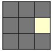
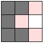
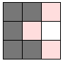
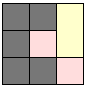
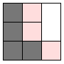

# Gerador de Laberintos
El proyecto esta basado en dos partes:
1. Script python que muestra por salida nuestro laberinto en un formato que explicaremos posteriormente.
2. Aplicación web que nos permite visualizar los laberintos en 3d. 

## 1-Generador Laberintos
Se trata de un script python en el que implementamos el algoritmo prim aleatorio. Este algoritmo nos genera 
un laberinto en el cual se puede encontrar un camino entre dos celdas del laberinto sin importar que dos 
celdas elegimos. Todas las partes de nuestro laberinto están conectadas.

El funcionamiento del algoritmo es el siguiente:

1. Teniendo en cuenta que partiremos de un laberinto 3x3, elegimos una celda aleatoria del laberinto y la marcamos como visitada.

    

2. Marcamos las celdas vecinas del laberinto como celdas frontera.

    
3. Elegimos una de las celdas frontera de forma aleatoria y añadimos los vecinos de dicha celda .

    

4. Una vez elgimos la celda frontera que vamos a conectar, seleccionamos una celda ya visitada adyacente a esta y la conectamos
eliminando el muro entre ellas. Si tenemos mas de una celda ya visitada adyacentes a la celda frontera elgiriamos de
forma aleatoria una de ellas.

    

5. Por ultimo añadimos los vecinos de visitados de la celda frontera elegida a la lista de celdas frontera que podremos elegir posteriormente.

    

6. Volvemos al paso 3 y el algoritmo continua hasta que no tengamos mas celdas fronteras que elegir.

Como hemos visto en los ejemplos anteriores el laberinto estará representado por una matriz cuadrada.

Como salida el  algoritmo nos muestra por salida un formato csv donde mostramos en la primera linea el tamaño del laberinto y en las siguientes la cordenada de la matriz en los primeros dos elementos y el muro que eliminamos de esta. 

Los muros tendrán valores de 1 si es el superior, 2 si es el muro derecho, 3 si es el inferior y 4 si es el muro izquierdo. 

Este seria un ejemplo de salida del script para un laberinto de tamaño 3.

~~~
3
1,2,1
1,2,4
1,2,3
0,2,4
2,2,4
1,1,4
1,0,1
2,1,4
~~~

Para guardarla en un fichero solo tenemos que redireccionar la salida de la siguiente manera.

~~~
python generadorLaberinto.py 3 >> laberinto3.csv
~~~

Como primer parametro pasamos el tamaño del laberinto.
